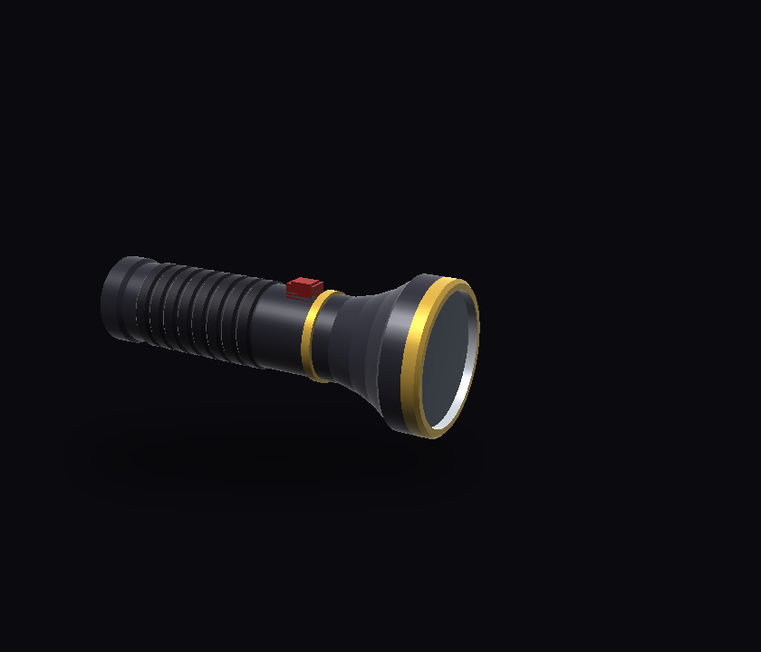
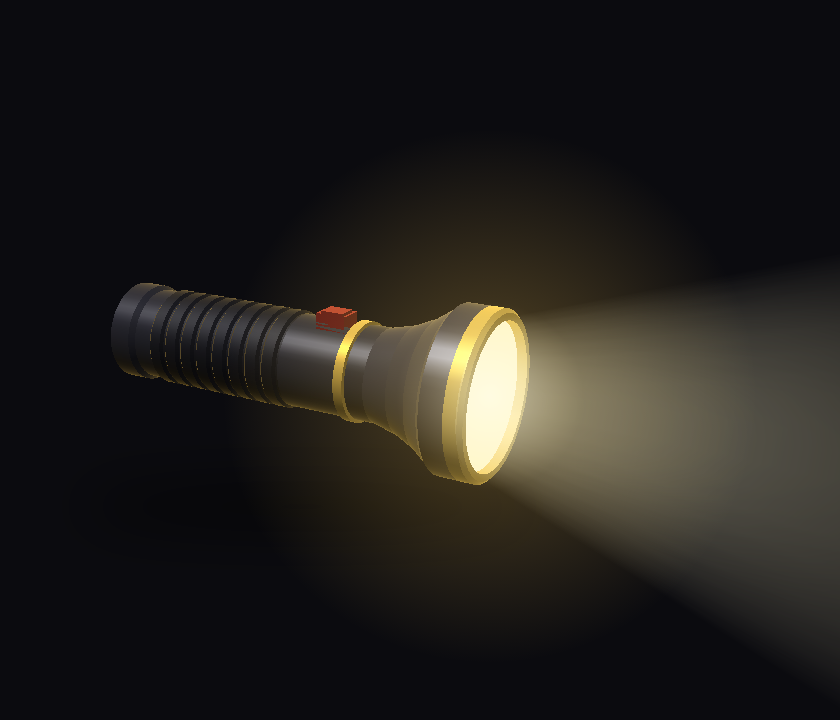

# Senter Premium

Aplikasi senter lelucon untuk konten: **menyalakan gratis, mematikan harus berlangganan.**

Pengguna tidak diberi tahu apa pun di awal. Senter menyala dengan normal, dan jebakannya baru terungkap saat mereka mencoba mematikannya.

| Mati | Menyala |
|---|---|
|  |  |

> Secara default aplikasi memakai **billing palsu**, jadi tidak ada uang sungguhan yang ditarik. Aplikasi ini dibuat untuk direkam, bukan untuk dijual.

## Fitur

- **Senter 3D interaktif.** Ketuk untuk menyalakan atau mematikan, geser untuk memutar. Saat dinyalakan, lampunya berkedip seperti bohlam, lalu muncul sorot cahaya, silau di lensa, dan bayangan.
- **Jebakan yang terungkap bertahap.** Sebelum percobaan pertama, tidak ada kata "gratis", badge, maupun gembok. Setiap percobaan mematikan membuat senter bergetar, HP bergetar, dan kalimat reaksinya makin dramatis.
- **Paywall yang terlalu serakah.** Paket "Pemula Gelap", "Penikmat Gelap", dan "Sultan Kegelapan", lengkap dengan harga coret, hitung mundur promo yang selalu mulai lagi dari 04:59, dan social proof.
- **Punchline.** Setelah "berlangganan", muncul layar *"Anda kini resmi termasuk 0,01% manusia yang mampu mematikan senter"*, lalu senter langsung mati.
- **Bisa take ulang.** Tekan lama badge **Premium** di app bar untuk mengembalikan akun ke Gratis.
- **Jalan di simulator.** Kalau perangkat tidak punya flash (misalnya simulator iOS), aplikasi otomatis memakai senter virtual.

## Menjalankan

Butuh Flutter 3.47 atau lebih baru (Dart 3.13).

```bash
flutter pub get
flutter run            # debug
flutter run --release  # untuk merekam di HP asli (lebih mulus)
```

Kalau Anda menambah atau mengganti asset (misalnya model 3D), hentikan aplikasi lalu jalankan `flutter run` lagi. Hot restart tidak cukup.

### Opsi build

Opsi ini diatur dengan `--dart-define` dan dibaca di [`lib/core/config/app_config.dart`](lib/core/config/app_config.dart).

| Opsi | Default | Fungsi |
|---|---|---|
| `FAKE_BILLING` | `true` | `false` = pakai Google Play / App Store sungguhan |
| `VIRTUAL_TORCH_FALLBACK` | `true` | `false` = tampilkan layar "tidak ada senter" di perangkat tanpa flash |

Contoh:

```bash
flutter run --dart-define=FAKE_BILLING=false
```

## Struktur proyek

Proyek ini disusun per fitur. Setiap fitur dibagi menjadi `domain` (aturan dan kontrak), `data` (implementasi), `application` (state dengan Riverpod), dan `presentation` (UI).

```
lib/
├── main.dart
├── app/                      MaterialApp
├── core/
│   ├── config/               AppConfig (flag build, ID produk)
│   ├── l10n/                 AppStrings — semua teks UI
│   ├── theme/                warna & tema
│   ├── animation/            kurva kedip bohlam
│   ├── widgets/              ShakeOnChange
│   └── three_d/              engine 3D (Vec3, Mesh, MeshBuilder, OBJ, Renderer3D, shading)
└── features/
    ├── flashlight/
    │   ├── domain/           FlashlightRepository
    │   ├── data/             TorchLight (hardware), Fake (virtual), Fallback
    │   ├── application/      FlashlightController, flashlightModelProvider
    │   └── presentation/     FlashlightPage, Flashlight3DView, PowerButton, AmbientGlow
    └── subscription/
        ├── domain/           Entitlement, SubscriptionPlan, PremiumFeature + FeatureGate
        ├── data/             StoreSubscriptionRepository, FakeSubscriptionRepository, PurchaseVerifier
        ├── application/      entitlementProvider, featureGateProvider, PaywallController
        └── presentation/     PaywallSheet, CelebrationDialog, PremiumBadge

tool/generate_flashlight_model.dart   pembuat model 3D
assets/models/flashlight.obj          model 3D senter
```

### Aturan inti

Aturannya ada di `FlashlightController.toggle()`:

- Menyalakan selalu diizinkan.
- Mematikan hanya diizinkan jika `featureGate.canUse(PremiumFeature.turnOffFlashlight)`. Kalau tidak, hasilnya `ToggleResult.premiumRequired` dan UI menampilkan paywall.

## Mengembangkan

### Menambah fitur berbayar

1. Tambahkan nilai baru di enum `PremiumFeature` ([premium_feature.dart](lib/features/subscription/domain/premium_feature.dart)).
2. Tentukan aturannya di `FeatureGate.canUse`.
3. Di tempat fitur itu dipakai, cek dengan `ref.read(featureGateProvider).canUse(PremiumFeature.fiturBaru)`.

### Mengubah teks dan harga

- Kalimat reaksi, teks paywall, dan teks perayaan ada di [app_strings.dart](lib/core/l10n/app_strings.dart). Kalimat reaksi disimpan di `deniedLines` dan tampil berurutan setiap kali pengguna gagal mematikan.
- Nama paket dan harga palsu ada di [fake_subscription_repository.dart](lib/features/subscription/data/fake_subscription_repository.dart).

### Mengganti model 3D

Model senter dibuat oleh skrip:

```bash
dart run tool/generate_flashlight_model.dart
```

Anda juga bisa memakai model dari Blender:

1. Ekspor ke **Wavefront OBJ** dengan opsi *Write Normals* aktif.
2. Beri nama material sesuai daftar berikut. Material lain akan tampil abu-abu.

   | Material | Tampilan |
   |---|---|
   | `body`, `grip`, `head` | logam hitam anodized |
   | `gold` | aksen emas |
   | `reflector` | perak, berpendar emas saat menyala |
   | `lens` | kaca, **menyala** saat senter hidup |
   | `button` | tombol karet merah |

3. Arahkan sumbu senter ke **+X** dengan lensa di ujung +X. Panjangnya kira-kira 2 unit.
4. Timpa `assets/models/flashlight.obj`. Kalau posisi atau ukuran lensanya berbeda, sesuaikan konstanta `_lensX`, `_lensRadius`, dan `_pivot` di [flashlight_scene_painter.dart](lib/features/flashlight/presentation/widgets/flashlight_scene_painter.dart).

Renderernya berjalan di CPU tanpa plugin. Kalau animasinya patah-patah di perangkat lambat, kurangi jumlah segitiga, misalnya dengan menurunkan `segments` di skrip generator.

### Mengganti sistem billing

Semua akses billing lewat interface `SubscriptionRepository`. Untuk pindah ke RevenueCat atau layanan lain, buat implementasi baru lalu ganti di `subscriptionRepositoryProvider` ([subscription_providers.dart](lib/features/subscription/application/subscription_providers.dart)).

## Test

```bash
flutter analyze
flutter test
```

Yang dicakup test:

- aturan menyalakan/mematikan untuk akun gratis dan premium
- fallback ke senter virtual
- parser dan penulis OBJ, serta isi model senter
- alur UI lengkap: nyala → paywall → perayaan → mati → reset
- eskalasi kalimat reaksi

## Kalau ingin rilis ke store

Aplikasi ini ditujukan untuk konten. Kalau tetap ingin memakai langganan sungguhan:

1. Buat produk langganan `senter_premium_weekly`, `senter_premium_monthly`, dan `senter_premium_yearly` di Play Console dan App Store Connect. ID-nya bisa diubah di `AppConfig`.
2. Ganti `applicationId` / bundle ID yang masih `com.example.senter_premium`.
3. Ganti `ClientSidePurchaseVerifier` dengan verifikasi di server. Saat ini data pembelian dari HP dipercaya begitu saja.
4. Build dengan `--dart-define=FAKE_BILLING=false`.

Keterbatasan:

- Pengguna tetap bisa mematikan senter lewat Quick Settings / Control Center, atau dengan menutup paksa aplikasi. Tampilan di aplikasi tidak ikut berubah dalam kasus itu.
- Apple dan Google bisa menolak aplikasi ini karena dianggap menyesatkan. Jelaskan dengan jelas di deskripsi store bahwa ini aplikasi lelucon.
